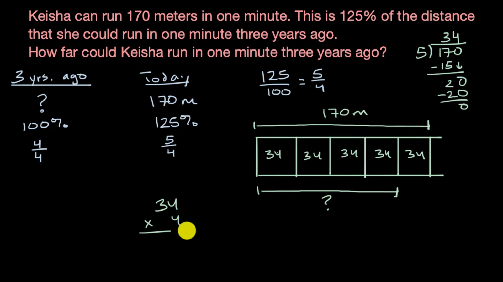

# Percentages — Meaning of Percent

## What is a Percent?

The word **percent** means **"per hundred"**.

A percentage tells us how many parts we have **out of 100 equal parts**.

The symbol for percent is `%`.

For example:

**25% = 25/100**

This means:

> 25 out of every 100 parts.

---

## Think of Percent as "Out of 100"

Whenever you see `%`, think:

> **"out of 100"**

Examples:

- **1%** = 1 out of 100
- **10%** = 10 out of 100
- **25%** = 25 out of 100
- **50%** = 50 out of 100
- **75%** = 75 out of 100
- **100%** = 100 out of 100

---

## Percent as a Fraction

A percentage can be written as a fraction with `100` as the denominator.

For example:

**25% = 25/100**

**50% = 50/100**

**75% = 75/100**

In general:

**x% = x/100**

---

## Percent as a Decimal

To convert a percentage into a decimal, divide it by `100`.

For example:

**25% → 25 ÷ 100 → 0.25**

**50% → 50 ÷ 100 → 0.50**

**75% → 75 ÷ 100 → 0.75**

### Rule

> **Percent → Decimal: Divide by 100**

---

## Common Percentages

| Percentage | Fraction | Decimal | Meaning |
|---|---|---|---|
| 10% | 1/10 | 0.10 | One-tenth |
| 25% | 1/4 | 0.25 | One-quarter |
| 50% | 1/2 | 0.50 | One-half |
| 75% | 3/4 | 0.75 | Three-quarters |
| 100% | 1 | 1.00 | The whole |

---

## Important Idea

A percentage does **not** mean that there must literally be 100 objects.

For example, suppose a class has **20 students** and **5 students are absent**.

The fraction of absent students is:

**5/20 = 1/4**

And:

**1/4 = 25%**

Therefore:

**25% of the students are absent.**

The percentage simply expresses the proportion **as if the whole were divided into 100 equal parts**.

---

# Key Takeaways

- **Percent means "per hundred".**
- `%` means **"out of 100"**.
- **25% = 25/100**
- To convert percent to a decimal, **divide by 100**.
- To convert decimal to percent, **multiply by 100**.
- Percentages describe a **proportion of a whole**.

## Mental Model

Whenever you see a percentage, ask yourself:

> **"How many out of 100?"**

For example:

**40% → 40 out of 100 → 40/100**

# Percent from Fraction Models

## Converting a Fraction into a Percentage

Suppose there is a square divided into **10 equal vertical sections**, and **4 sections are shaded**.

There are **10 sections in total**, and **4 are shaded**.

So the fraction of the square that is shaded is:

**4/10**

To convert this fraction into a percentage, we need to convert the **denominator into 100**, because percent means **out of 100**.

The denominator is `10`.

To make `10` into `100`, we multiply it by `10`:

**10 × 10 = 100**

Whatever we multiply the denominator by, we must also multiply the numerator by the **same number**.

So:

**4 × 10 = 40**

Therefore:

**4/10 = 40/100**

And since `40/100` means **40 out of 100**:

**40/100 = 40%**

Therefore:

**4/10 = 40%**

---

## The Multiplier Depends on the Denominator

The denominator does **not** always have to be `10`.

It depends on the number of equal sections in the whole.

The goal is always to change the denominator into **100**.

For example, suppose there are **25 equal boxes**, and **12 of them are shaded**.

The shaded portion is:

**12/25**

Now we need to change the denominator `25` into `100`.

To do that:

**25 × 4 = 100**

So we also multiply the numerator by `4`:

**12 × 4 = 48**

Therefore:

**12/25 = 48/100**

And:

**48/100 = 48%**

So:

**12/25 = 48%**

---

## Another Example

Suppose there are **20 equal sections**, and **6 are shaded**.

The shaded portion is:

**6/20**

To convert the denominator to `100`:

**20 × 5 = 100**

So we multiply the numerator by `5` as well:

**6 × 5 = 30**

Therefore:

**6/20 = 30/100**

And:

**30/100 = 30%**

So:

**6/20 = 30%**

---

## The Method

When converting a fraction into a percentage using a fraction model:

1. **Count the total number of equal sections.**
   This is the denominator.

2. **Count the shaded sections.**
   This is the numerator.

3. **Write the fraction.**

4. **Find what number the denominator needs to be multiplied by to become 100.**

5. **Multiply the numerator by the same number.**

6. The resulting fraction will have `100` as its denominator.

7. The numerator is then the percentage.

### Example

**7/25**

Make the denominator `100`:

**25 × 4 = 100**

Multiply the numerator by `4`:

**7 × 4 = 28**

Therefore:

**7/25 = 28/100 = 28%**

---

## Key Idea

The important thing is **not the original denominator**.

It can be `10`, `20`, `25`, or another number.

What matters is:

> **Find the number that multiplies the denominator to make 100, then multiply the numerator by that same number.**

### In short:

**Fraction → Make denominator 100 → Same multiplication to numerator → Percentage**

# Finding the Whole with a Tape Diagram

## Example

Keisha can run **170 meters in one minute today**.

This is **125%** of the distance she could run in one minute **three years ago**.

We want to find:

> How far could Keisha run in one minute three years ago?

---

## Step 1: Understand What 125% Means

The distance Keisha could run three years ago represents **100%**.

Today, she can run **125%** of that distance.

So the **170 meters** that she can run today represents **125%** of her previous distance.

We can rewrite `125%` as a fraction:

**125% = 125/100**

Now simplify the fraction by dividing both the numerator and denominator by `25`:

**125/100 = 5/4**

So:

**170 meters = 5/4 of the distance she could run three years ago.**

---

## Step 2: Understand the Tape Diagram

If the whole distance from three years ago is **100%**, then:

**100% = 4/4**

And today:

**125% = 5/4**

So the **170 meters** represents **5/4**.

We want to find the value of **4/4**, because that represents the original whole.

---

## Step 3: Find the Value of One Fourth

Since **5/4 = 170 meters**, we can divide `170` by `5` to find the value of one fourth.

**170 ÷ 5 = 34**

So:

**1/4 = 34 meters**

Each fourth represents **34 meters**.

---

## Step 4: Find the Whole

The original distance is **4/4**.

Since each fourth is `34 meters`:

**34 × 4 = 136**

Therefore:

**4/4 = 136 meters**

So Keisha could run:

**136 meters in one minute three years ago.**

---

## Key Idea

When a given amount represents a percentage greater than `100%`:

1. Convert the percentage into a fraction.
2. Simplify the fraction.
3. Use the given amount to find the value of one part.
4. Multiply by the number of parts that make up the whole.

### In this example:

**125% → 125/100 → 5/4**

**170 ÷ 5 = 34**

**34 × 4 = 136**

**Answer: 136 meters**

